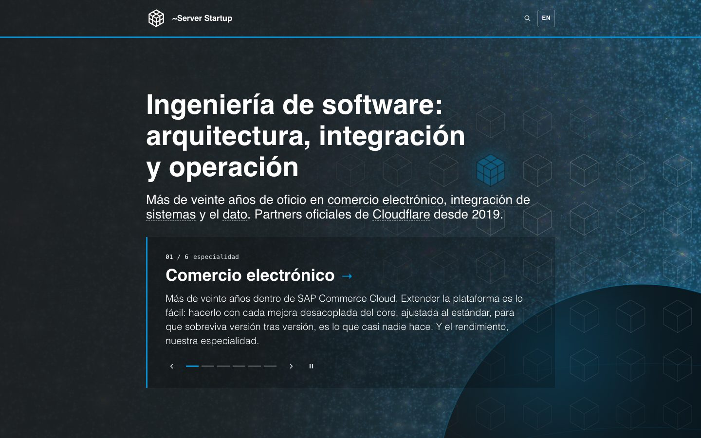

# The rotating hero — the six plates

Six drawn images, one per vertical, behind the home's headline and at the top of each
vertical's own page (#413). They are the **same object** in all six: the brand cube. What
changes is what each trade does to it.

| Face | Vertical | Colour | What happens to the cube |
| --- | --- | --- | --- |
| `ec` | Comercio electrónico | `#008FD3` | Repeated into a wall; one is lit — the order among a million |
| `int` | Integración de sistemas | `#1D4E89` | Pierced — the tangle goes in, one clean path comes out |
| `bd` | Big Data & Cloud Analytics | `#EA4335` | Drawn out of a point cloud; the crosshair marks the outlier |
| `cdn` | CDN, WAF y seguridad edge | `#F38020` | Wrapped around the world; its six vertices are the nodes, the limb is the edge |
| `gf` | Desarrollo greenfield | `#3E7D50` | Being built on an empty plane; exactly one voxel is placed |
| `ia` | Inteligencia artificial | `#6B4FBB` | Lit from the inside, vertex to vertex |

**The drawing is the subject; the photograph is the room.** Each plate is two files — a
transparent SVG drawing and, under it, a real NASA frame. Stock photography would have swapped
a distinctive identity for a generic one, and it still would; what a NASA image gives instead
is a ground no competitor can buy and nobody has to license.

## The ground is a photograph now

The six used to invent their own sky: a vignette, three cloud lobes, seven hundred drawn stars
and a dozen diffraction flares per plate. The founder killed it twice — first as *"un fondo
negro con puntitos blancos"*, and then, when a real star catalogue replaced the invented one,
as *"lo veo muy aburrido, a la mierda… me parece bien que haya una base real, real real, es
decir con una imagen de la NASA y NO generada por computador"*. He was right both times: a
drawing of a sky under a drawing is two drawings, and the second one always loses.

So `sky()` now returns nothing but its defs, and under each plate sits a photograph from
NASA's public archive, prepared by [`grounds.py`](grounds.py). Four rules chose and cut them.

**One. The photograph says what the drawing says.** Not just the right colour — the right
event. `int` draws a tangle going in and one clean path coming out, so its ground is HH 34, a
star firing a collimated jet straight out of a knot of gas. `ia` draws a cube lit from the
inside, so its ground is RS Puppis, a star lighting the cloud it sits in. `ec` draws one lit
cube among a repeated wall, so its ground is a globular cluster: a uniform carpet of a million
identical points. The photograph is not a backdrop that happens to be the right hue; it is the
same sentence, said by a camera.

**Two. The crop is solved, not composed.** Each ground carries a measured feature point in its
source frame — the jet's throat, the cluster's core, the outlier star — and a target point in
the 720x450 ground, taken from where `generate.py` actually draws the subject on the plate.
`treat()` turns those two numbers into the crop offset by arithmetic and reports its own drift;
**all six land at 0 px**. `int` is also rotated -53 degrees before cropping, which turns HH 34's
steep down-right jet into the shallow up-right line the drawn path follows. The `GROUNDS` table
is a set of measurements, not a set of preferences.

**Three. Colour by subtraction.** Rotating each source's hue onto its token was tried and
rejected on sight: it turned the cluster's stars pink, the aurora red and `ia` yellow-green.
What ships instead cuts chroma (saturation to about half) and then adds the token as a 30-38%
colorize — the source keeps its own luminance and its own structure, and its
saturation-weighted mean hue lands on the vertical's token: `ec` 201.1 deg against a token of
199.3, `int` 213.5 / 212.8, `bd` 3.8 / 4.6, `cdn` 27.6 / 27.3, `ia` 263.7 / 255.6. The founder's
condition — *"que la imagen original no sólo sea del color objetivo"* — is met by measurement,
not by a duotone. `gf` misses by 13 degrees, and honestly: an aurora is the green the sky was,
not the green in `theme.css`.

**Four. Weight comes off, focus does not.** *"Tendrás que quitarles peso mediante capas que
difuminen"* was first read as a defocus, and a blurred version shipped to review. The founder
rejected it — *"las veo muy desenfocadas"* — and he was right: a defocused photograph looks
like a mistake at any size. The weight now comes off through brightness and saturation at
BUILD time, never in CSS: a `filter: blur()` on a full-bleed element is a composite the GPU pays
for on every frame of the cross-fade, and the scrim over the copy was always doing the real work.

| Face | Photograph | Credit |
| --- | --- | --- |
| `ec` | A globular cluster losing stars to its own tides | NASA, ESA and the Hubble Heritage Team (STScI/AURA) |
| `int` | HH 34, a Herbig-Haro jet | NASA, ESA and the Hubble Heritage Team (STScI/AURA) |
| `bd` | The Hubble eXtreme Deep Field | NASA, ESA, G. Illingworth, D. Magee, P. Oesch, R. Bouwens and the HUDF09 Team |
| `cdn` | Saturn's limb and rings, Cassini | NASA/JPL/Space Science Institute |
| `gf` | The Earth's limb at orbital sunrise, ISS Expedition 23 | NASA |
| `ia` | RS Puppis, a star lighting the cloud it sits in | NASA, ESA and the Hubble Heritage Team (STScI/AURA)-Hubble/Europe Collaboration |

**Green is the one honest problem.** Deep sky has no green: the eye's response and the filters
observatories map to RGB conspire against it, and there is not one green nebula in the archive.
The only real green NASA photographs of space are auroras seen from the ISS, so `gf` is the
Earth's limb at orbital sunrise with the star field above it — a photograph taken in space, of
space, green because the sky was green that morning. It also happens to be the right picture:
the plate draws an empty plane with the first voxel placed on it, and a limb is what an empty
plane looks like from orbit.

**The drawing keeps its own bed.** A 1.4px stroke at 0.3 opacity reads over brand ink and
disappears over a star field, so each plate lays a soft out-of-focus ellipse of `#1E1E1E` under
its own subject before drawing it (`bed()` in `generate.py`). The photograph stays a photograph
at the edges of the frame and gives way exactly where the drawing has to be read — the same job
the scrim does for the headline, done for the picture. It is what lets the grounds stay as
bright and as coloured as they are.

**Licensing.** NASA imagery is public domain and free for commercial use. The conditions are
attribution — the table above — and no implied endorsement, which is why the credits belong in
the colophon and never beside a claim about the company.

## Resolution, and why there is no srcset ladder

Once the blur went, the softness that was left was not blur at all: it was a 720x450 image
painted across 3412 device pixels on the founder's screen, a 4.7x upscale. The proof was in his
own screenshot — the SVG plate is crisp in the same frame, because it is vector.

So the grounds ship at **2160x1350 in AVIF**, with a **720x450 JPEG** underneath for the one
browser that still needs it, through a `picture` element. AVIF is what makes the resolution
affordable: **210 KB for all six at 2160x1350**, against 815 KB for the same six as JPEG. The
JPEG fallback stays at 720x450 on purpose — it is a floor, not a second ladder.

A width ladder (`srcset` + `sizes`) would be correct and completely inert here, which is worth
writing down because the instinct is to reach for it. The band is `object-fit: cover` over
roughly `100svh`, so the wider the viewport is *relative to its height*, the fewer horizontal
image pixels it needs — and a portrait phone is the hungriest device of all. Measured horizontal
need, in image pixels: iPhone 14 Pro 4794, Pixel 7 4035, iPad Air 3776, a 16-inch laptop 3412,
iPhone SE 3290, desktop at 1x 2560. Every one of them is above 2160, so every one of them would
pick the 2160 candidate out of any ladder offered. The ladder would cost markup and save nothing.

The lever that *would* pay on a phone is a different **crop**, not a different width: a 3:4
version of each ground selected with `source media="(orientation: portrait)"`, which would stop
the phone throwing away two thirds of a 16:10 frame. That is not built. It is a real
improvement and it is deliberately out of scope here.

## The subject still lives in the right half

**The body lives in the right half of the frame.** That is a composition rule, not a
preference: the scrim darkens the left because the copy is there, so a world on the left is a
world nobody sees — and on a phone, where the plate is cropped to `object-position: 72%`, it
is cropped away entirely. `ec`, `int` and `bd` were drawn left first and moved.

**Every subject sits inside `y` 150-760**, and that is a hard constraint rather than a
composition choice. The band is `min-height: 100svh` with `object-fit: cover`, so any viewport
that is not 3:2 crops the plate top and bottom — 112px each at 1920x860, 100px at 1440x700.

## Regenerating them

```sh
python3 docs/design/hero-rotativo/generate.py   # the drawings
python3 docs/design/hero-rotativo/grounds.py    # the photographs under them
```

`generate.py` writes `public/assets/hero/{ec,int,bd,cdn,gf,ia}.svg` — the transparent drawings
the site serves — plus `public/assets/menu/ground.svg` (the menu panel's ground: the same cube
lattice, no stars and no subject, #417) and `images.json` next to itself for the design canvas.
The RNG is seeded, so a re-run reproduces the same bytes; change composition **here**, never by
hand-editing an SVG. Setting `PHOTO_GROUND = False` brings the old self-contained plates back —
the drawings themselves never changed.

`grounds.py` downloads the originals into a git-ignored `.cache/` — preferring each asset's
`~orig` over its `~large`, because the difference is routinely 2-4x the pixels — caches the
rotated intermediate beside it, and writes `public/assets/hero/ground/*.{avif,jpg}`, which ARE
committed: the site never fetches from NASA at runtime. It prints the crop drift for every
ground; anything but `0 px` means a source changed under a measured feature point. It needs
ImageMagick (`magick`) on the path, built with AVIF support.

The plates carry no `role`, no `aria-label` and no `<title>`: they are decorative. The ``
that shows them has `alt=""` and the vertical's name sits beside it as a real link — a label in
the file would be locale-bound copy living outside the CMS, and it would announce the picture
twice.

All six drawings together are ~60 KB gzipped (`bd` is the outlier — it is ~4,000 circles) and
the six photographs add **210 KB** for all of them at 2160x1350 (the JPEG floor is 167 KB at
720x450). Only one of them is on the critical path: the home's first slide, `ec`, at 108 KB with
`fetchpriority="high"`; the other five are `loading="lazy"` and `fetchpriority="low"`, so they
arrive while the first slide is still on screen. Six slides, two layers apiece and a pure-CSS
cross-fade still cost less than the one stock photograph they replace, with no JavaScript
involved.

The gate that measures ink over the plates ([`ci-check-a11y.mjs`](../../../scripts/ci-check-a11y.mjs)
§5) blanks the copy, screenshots the band and takes the 98th percentile of the ground's
luminance behind every text box. With these grounds it reads **5.2:1 at its tightest**
(`.s-hero__body` on `/integracion-de-sistemas`, plate 1 at 1440) over 192 text boxes and 48
plate frames — the brightness figures in `GROUNDS` are tuned against that number, so a brighter
source has to be paid for there.

## Where the code is

| Piece | File |
| --- | --- |
| Face → file map | [`src/utils/hero-art.ts`](../../../src/utils/hero-art.ts) |
| The home's rotation | [`src/components/HomepageContent.astro`](../../../src/components/HomepageContent.astro), [`src/styles/homepage.css`](../../../src/styles/homepage.css) |
| The vertical page's still plate | [`src/pages/[slug].astro`](../../../src/pages/%5Bslug%5D.astro), [`src/styles/service.css`](../../../src/styles/service.css) |
| The photographic ground | [`grounds.py`](grounds.py); `.s-hero__ground` in [`homepage.css`](../../../src/styles/homepage.css) and [`service.css`](../../../src/styles/service.css) |
| The solved crop and the colour | `GROUNDS` and `treat()` in [`grounds.py`](grounds.py) |
| The bed under each subject | `bed()` in [`generate.py`](generate.py) |
| Face -> ground file map (AVIF + JPEG) | `HERO_GROUND` in [`src/utils/hero-art.ts`](../../../src/utils/hero-art.ts) |
| The bar over the picture | [`src/components/SiteHeader.astro`](../../../src/components/SiteHeader.astro) |
| Scrim, ink and clock tokens | [`src/styles/theme.css`](../../../src/styles/theme.css) |
| The gate that measures ink over the plates | [`scripts/ci-check-a11y.mjs`](../../../scripts/ci-check-a11y.mjs) §5 |

## Previews

Captures of the built site, not mockups.




