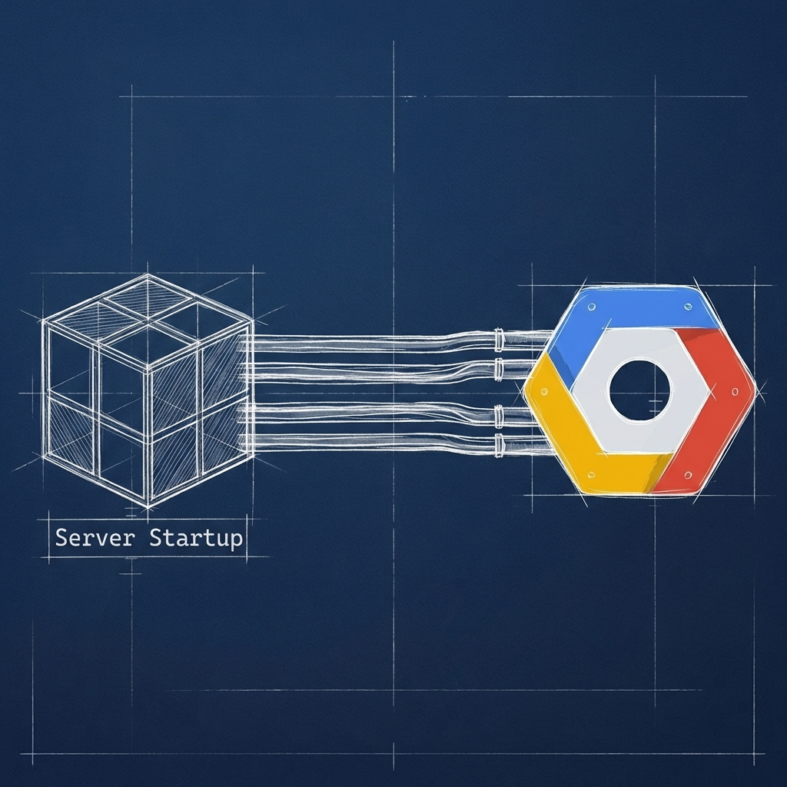

## **Página: Big Data & Cloud Analytics**

### **Título SEO**

Arquitectura de datos y analítica cloud | Server Startup

### **Meta descripción**

Diseñamos arquitecturas de datos escalables en Google Cloud Platform. Soluciones Big Data, dbt y BigQuery para obtener valor real de la información.

### **Slug SEO**

/servicios/big-data

### **H1: Big Data y analítica cloud para decisiones precisas**

En **Server Startup** transformamos grandes volúmenes de datos en información útil para tu negocio. Creamos arquitecturas sólidas y escalables en la nube, que permiten analizar, integrar y visualizar tus datos con eficiencia.

CTA: Solicita una consultoría de datos (/contacto)

### **H2: Arquitecturas de datos en Google Cloud Platform**

Diseñamos entornos en **Google Cloud Platform (GCP)** con herramientas como **BigQuery**, **dbt** y **Dataflow**. Nuestro objetivo es construir sistemas que gestionen el ciclo completo del dato: desde la ingesta hasta el análisis final.

CTA: Descubre cómo aprovechar tus datos (/contacto)

### **H2: Estructura por capas para una gestión más eficiente**

Trabajamos con arquitecturas por niveles (**bronze / silver / golden**) que garantizan calidad, trazabilidad y control. Esta metodología permite segmentar los datos según su estado y precisión, facilitando un uso más eficaz y seguro.

CTA: Mejora la calidad de tus datos (/contacto)

### **H2: Integración con sistemas empresariales**

Integramos tus fuentes de datos, plataformas de venta y sistemas internos en una misma arquitectura. De esta forma, tu empresa puede acceder a una visión completa y actualizada del rendimiento operativo y comercial.

CTA: Centraliza tus fuentes de información (/contacto)

### **H2: Analítica avanzada y visualización**

Implementamos herramientas de análisis y cuadros de mando que te ayudan a entender y tomar decisiones basadas en datos. Desde el seguimiento de ventas hasta el comportamiento del usuario, todo se muestra de forma clara y accesible.

CTA: Solicita una demo personalizada (/contacto)

### **H2: Beneficios del enfoque cloud**

- Escalabilidad automática según la carga de trabajo.

- Costes optimizados y pagos por uso real.

- Integración nativa con servicios de Google Cloud.

- Mayor seguridad y trazabilidad del dato.

- Acceso remoto y control total de la información.

CTA: Habla con nuestro equipo técnico (/contacto)
