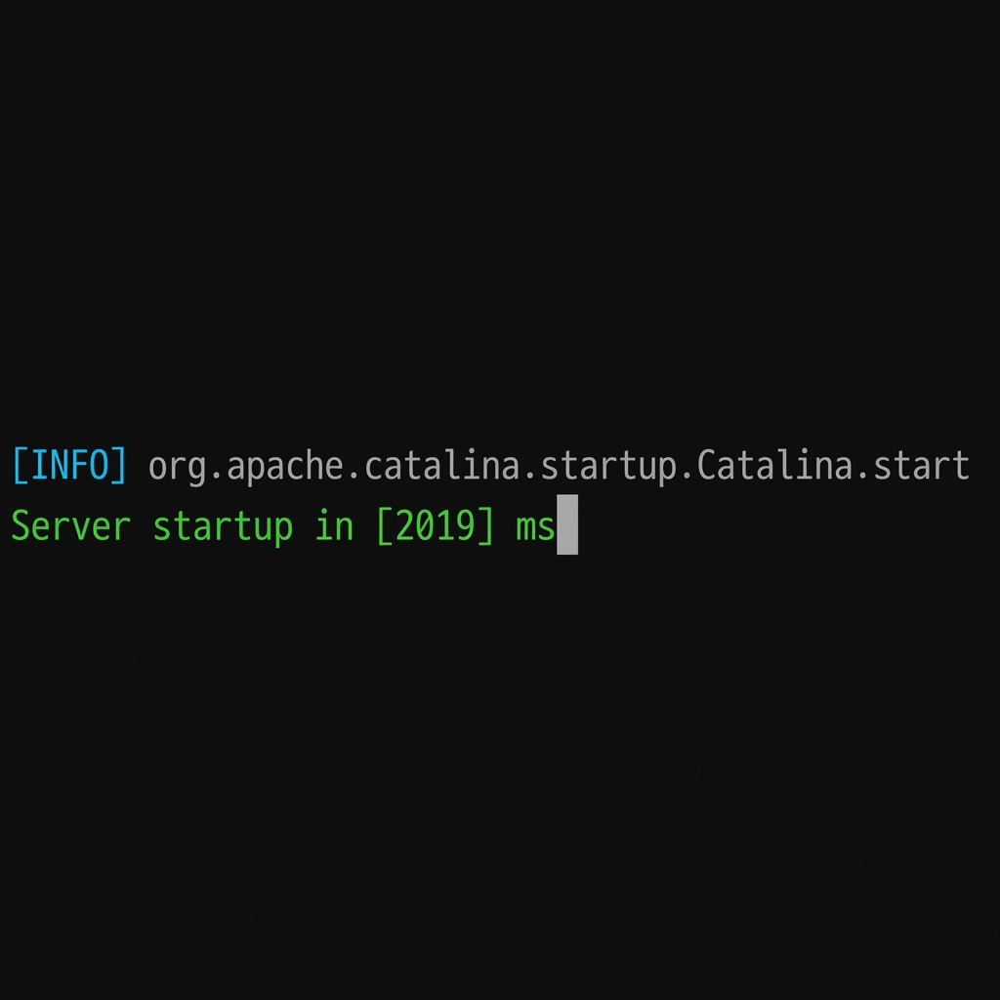

## **Página: Historia**

### **Título SEO**

Trayectoria en Ingeniería y Gobernanza Técnica | Server Startup

### **Meta descripción**

Ingeniería boutique especializada en arquitecturas críticas. Aportamos certeza técnica, gobernanza de datos y seguridad perimetral para ecosistemas digitales complejos.
### **Slug SEO**

/historia

### **H1: `Server startup in [2019] ms`**

`org.apache.catalina.startup.Catalina.start Server startup in [2019] ms`

Nuestra historia se define en una línea de log. Fundada en 2019, **Server Startup** debe su nombre a la trinchera de **SAP Commerce** (antes Hybris). 2 de la mañana en un hotel, café y terminal. Cientos de horas de compilación esperando ese mensaje de Tomcat que confirmaba que el sistema había levantado. Para nosotros, esa línea no era solo texto; era la señal de que la lógica funcionaba, un hito en el camino. A por el siguiente.

Somos **"Server"** porque nuestro foco es el *backend*: la lógica de negocio, el rendimiento del servidor y la integridad de los datos. Priorizamos la estabilidad del motor sobre la capa visual.

Somos **"Startup"** en el sentido técnico del término: el proceso de arranque. Diseñamos sistemas con tiempos de inicialización optimizados y capacidad de despliegue rápido. Entendemos la agilidad como la capacidad de poner en producción cambios validados sin fricción.

### **H2: Del Monolito a la Colmena**

<video src="../../media/logo/20251123%20-%20Logo_v2.mp4" controls width="100%"></video>

Nuestra identidad visual ha evolucionado con nuestra arquitectura. Si el log de Tomcat representa el monolito Java tradicional, nuestro isotipo actual —el cubo reticular— refleja la transición hacia sistemas distribuidos.

Este concepto deriva de la ingeniería de **Ocado Smart Platform** y sus "hives" (colmenas), donde la orquestación de miles de agentes requiere una sincronización determinista. Es la representación de lo que construimos: **escalabilidad, orden y trazabilidad**.

Donde antes había un servidor único, hoy hay una topología distribuida, gobernada por contrato y protegida en el borde. La complejidad interna debe traducirse en simplicidad operativa.

### **H2: Ingeniería de Autor (Boutique)**

No operamos con estructuras masivas. Mantenemos un equipo deliberadamente compacto de ingenieros senior que ejecutan lo que diseñan. Defendemos el *Skin in the Game*: la responsabilidad técnica no se delega, se ejerce.

Evitamos el modelo de rotación de perfiles. Ofrecemos **criterio, memoria técnica y ejecución directa**. La complejidad se gobierna con *expertise*, no añadiendo más capas de gestión.

**Nuestros Principios:**

- **Certeza > Velocidad:** Preferimos una arquitectura resiliente hoy que deuda técnica mañana.
- **Gobernanza:** El código cambia; el control sobre los datos y la seguridad es el activo permanente.
- **Independencia Técnica:** Prescribimos tecnología basándonos en la idoneidad técnica, no en acuerdos comerciales con fabricantes.

CTA: Conoce al equipo (/quienes-somos)
