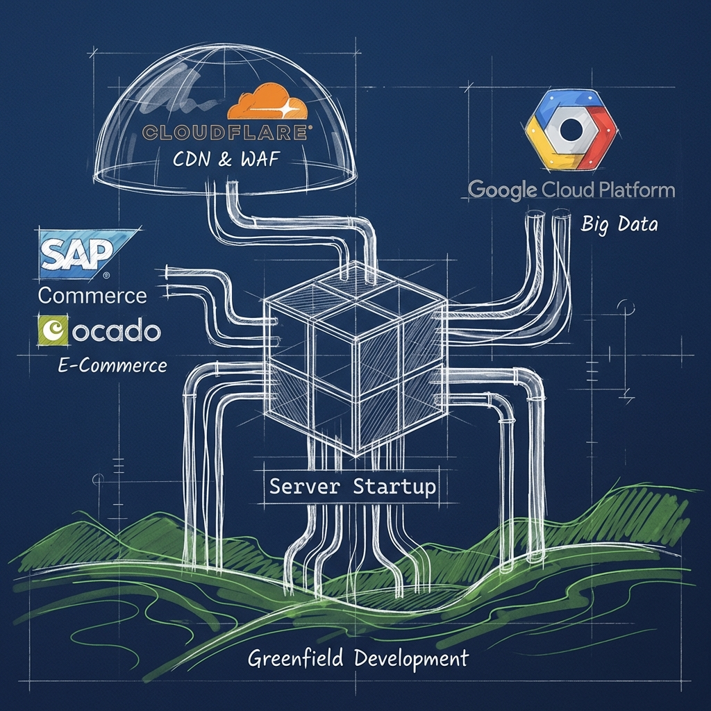

## **Página: Inicio**

### **Título SEO**
Artesanía de Software y Eficiencia Operativa | Server Startup

### **Meta descripción**
Artesanía de software e ingeniería de sistemas. Diseñamos arquitecturas resilientes y orquestamos integraciones fluidas. Desde el código _Greenfield_ hasta la seguridad `edge`, construimos infraestructuras sólidas con honestidad y visión de largo plazo.

### **Slug SEO**
/inicio

### **H1: Ingeniería de Sistemas, Integración y Seguridad `edge`**
Construimos arquitecturas completas capa a capa. Cimentamos con ingeniería _Greenfield_ sólida, conectamos sistemas de forma resiliente, impulsamos el negocio con plataformas de comercio electrónico y blindamos el perímetro con seguridad `edge`. Gestionamos tu tecnología como un activo estratégico unificado, robusto y gobernable.

### **H2: Tecnología que impulsa tu negocio**
Somos un equipo pequeño de ingenieros. Huimos de las metodologías rígidas y nos centramos en entender el contexto de cada proyecto. Aplicamos juicio técnico y cuidamos la calidad de los entregables porque creemos que es la única forma sostenible de construir software.

### **H2: Áreas de especialización**
Aportamos la profundidad técnica necesaria para identificar la solución más viable. Mantenemos una visión global del sistema, pero ejecutamos con pragmatismo siguiendo nuestro flujo arquitectónico:

> **[Sugerencia Frikitek]:** Aquí recomendamos implementar un **Mapa de Imágenes Interactivo (_Blueprint_)**.
> en lugar de una lista plana, mostramos la arquitectura como un organismo vivo:
> 1.  **Cimientos (Abajo):** Ingeniería _Greenfield_ (Sólido).
> 2.  **Núcleo (Centro):** Integración (Conectado).
> 3.  **Ramas (Arriba):** E-commerce y Big Data (Frutos).
> 4.  **Escudo (Perímetro):** Cloudflare (Protección).
>
> *Al hacer hover/click en cada zona, el usuario debería navegar a la sección profunda correspondiente infra.*

#### **H3: [Ingeniería _Greenfield_ y Sistemas Críticos](/servicios/ingenieria-greenfield)**
Empezamos por la base. Construimos código limpio y mantenible desde cero para resolver problemas específicos. Sin generar deuda técnica, solo cimientos sólidos.

#### **H3: [Integración de sistemas](/servicios/integracion-de-sistemas)**
El núcleo que conecta todo. Orquestación de servicios y desacoplamiento de sistemas. Utilizamos **Apache Camel**, **Talend** y herramientas de **Google Cloud** para conectar aplicaciones dispares, facilitando el flujo de información y evitando la deuda técnica de las integraciones punto a punto.

#### **H3: [Comercio electrónico](/servicios/comercio-electronico)**
Gestionamos plataformas de alto volumen. Trabajamos con **SAP Commerce Cloud** para desarrollar el núcleo del negocio y nos integramos con el ecosistema de **Ocado** para extender sus capacidades. Nos enfocamos en la estabilidad y el rendimiento del sistema en momentos críticos.

#### **H3: [Big Data & Cloud Analytics](/servicios/big-data)**
Diseñamos arquitecturas de datos en **Google Cloud**. Utilizamos **dbt** para estructurar y testear los modelos en **BigQuery**, asegurando que el dato sea trazable y fiable desde la ingesta hasta el análisis. Priorizamos la gobernanza y la mantenibilidad del código.

#### **H3: [CDN, `WAF` & Seguridad `edge` (Cloudflare)](/servicios/cdn-waf)**
El escudo perimetral. Optimizamos la entrega de contenido y la seguridad. Como **Partner oficial**, configuramos el `WAF` de Cloudflare, desplegamos políticas _Zero Trust_ y ejecutamos lógica de negocio en el `edge` con Workers para mejorar la latencia y reducir la carga en el origen.

### **H2: Cercanía y compromiso**
Creemos en las relaciones duraderas basadas en la **confianza radical**.
No somos una fábrica de tickets. Somos tus socios técnicos. Te acompañamos con honestidad brutal: si algo no es buena idea, te lo diremos. Si hay un riesgo, lo asumiremos contigo. Compartimos el riesgo.

### **H2: Empresas que confían en nosotros**
***Espacio para mostrar logos o nombres de clientes.***
Organizaciones que valoran la excelencia técnica y el trato directo. Clientes que han dejado atrás el "body shopping" para invertir en **solvencia y tranquilidad**.

### **H2: ¿Listo para optimizar tu infraestructura digital?**
Hablemos de ingeniero a ingeniero, con el negocio en el centro.
Cuéntanos tu reto y te daremos una visión honesta de cómo resolverlo. Sin comerciales, solo soluciones.

### **CTA: Contacta ahora (/contacto)**
