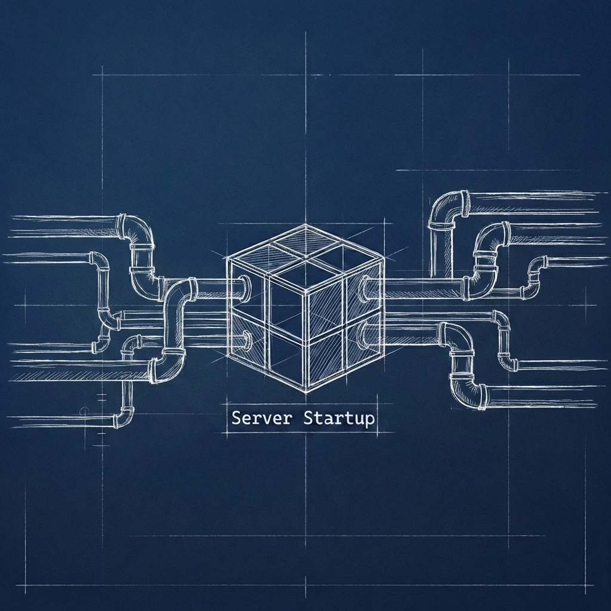

## **Página: Integración de sistemas**

### **Título SEO**

Integración de Sistemas Críticos y Arquitecturas EIP | Server Startup

### **Meta descripción**

Orquestamos el caos entre sistemas heterogéneos. Especialistas en [EIP](https://www.enterpriseintegrationpatterns.com/) combinando según necesidad el ecosistema [Apache Camel](https://camel.apache.org/) ([Talend](https://www.talend.com/), [Karaf](https://karaf.apache.org/), [Quarkus](https://camel.apache.org/camel-quarkus/)) con la potencia de Google Cloud ([Dataflow](https://cloud.google.com/dataflow), [Pub/Sub](https://cloud.google.com/pubsub), [Cloud Functions](https://cloud.google.com/functions)).

### **Slug SEO**

/servicios/integracion-de-sistemas

### **H1: Conectamos tus sistemas para que trabajen como uno solo**
 
 

La realidad empresarial es heterogénea: conviven sistemas heredados, ERPs monolíticos y arquitecturas distribuidas que operan en silos. En Server Startup no ponemos parches; aplicamos [**patrones de integración empresarial (EIP)**](https://www.enterpriseintegrationpatterns.com/) para orquestar el caos. Lo hacemos con un equipo reducido de ingenieros senior que ejecutan directamente, sin capas de gestión ni consultores junior en formación. Hacemos que plataformas dispares funcionen como un organismo unificado.

CTA: Solicita una evaluación de tus integraciones (/contacto)

### **H2: Integración core y cloud**

El reto no es migrar a la nube; es garantizar la continuidad operativa durante la transición. Diseñamos arquitecturas híbridas que conectan tu núcleo transaccional (*on-premise*) con ecosistemas Cloud como [Google Cloud](https://cloud.google.com/). 

Conectamos los Sistemas Operacionales (`SOR`) con los [Sistemas Analíticos](/servicios/big-data) (`SOI`), cerrando el ciclo del dato.

Seleccionamos el enfoque óptimo para el movimiento de datos: **ELT** con [**Fivetran**](https://www.fivetran.com/) para replicación masiva, o **ETL** con [**Apache Hop**](https://hop.apache.org/) cuando se requieren transformaciones complejas en origen.

CTA: Moderniza la integración de tu empresa (/contacto)

### **H2: Herramientas para la orquestación de datos**

Seleccionamos la plataforma según la necesidad estratégica. Implementamos desde tecnologías abiertas como [**Apache Camel**](https://camel.apache.org/) hasta soluciones visuales tipo `iPaaS` como [**Talend**](https://www.talend.com/). Priorizamos el balance entre velocidad de desarrollo y control total. Nuestra caja de herramientas:
*   **Mediación y Transformación:** Dominamos el ciclo completo. [**Apache Camel**](https://camel.apache.org/) (sobre [**Karaf**](https://karaf.apache.org/) o [**Quarkus**](https://camel.apache.org/camel-quarkus/)) para integración por código, y [**Talend**](https://www.talend.com/).
*   **Mensajería y Eventos:** Implementamos `backbones` de comunicación asíncrona con [**Kafka**](https://kafka.apache.org/), [**Pub/Sub**](https://cloud.google.com/pubsub) o [**ActiveMQ (Artemis)**](https://activemq.apache.org/components/artemis/).
*   **Cloud Native Integration:** Escalamos procesos críticos utilizando [Google Cloud](https://cloud.google.com/) ([**Dataflow**](https://cloud.google.com/dataflow), [**Cloud Functions**](https://cloud.google.com/functions) o [**Cloud Tasks**](https://cloud.google.com/tasks)) o [**Cloudflare Workers**](https://workers.cloudflare.com/) para lógica en el `edge`.

CTA: Descubre nuestras soluciones técnicas (/contacto)

### **H2: APIs seguras y personalizadas**

Una API no es solo un *endpoint*, es un contrato. Diseñamos interfaces bajo metodologías [**Contract First**](/servicios/ingenieria-greenfield), asegurando que cada servicio sea gobernado, seguro y documentado. Aplicamos estándares de seguridad (`OAuth 2.0`, `mTLS`) y cumplimiento normativo desde el diseño, no como parche posterior.

CTA: Mejora la comunicación entre tus sistemas (/contacto)

### **H2: Supervisión y mantenimiento continuo**

La integración es crítica: si falla, el negocio se detiene. Por eso actuamos como socios, no como proveedores. Monitorizamos activamente los flujos de datos para detectar cuellos de botella antes de que afecten al usuario. Ofrecemos **Skin in the Game**: asumimos la responsabilidad de la estabilidad operativa de lo que construimos. No hay capas intermedias; quien diseña es quien responde.

CTA: Habla con nuestro equipo técnico (/contacto)

### **H2: Impacto de una Arquitectura Desacoplada**

- **Certeza Operativa:** El dato correcto, en el lugar correcto, siempre.

- **Desacoplamiento Real:** Cambia piezas de tu arquitectura sin demoler el edificio.

- **Escalabilidad por Diseño:** Sistemas preparados para picos de carga masivos (campañas clave).

- **Gobernanza del Dato:** Trazabilidad completa de quién consume qué y cuándo.

- **Eficiencia de Costes:** Eliminamos duplicidades y procesos manuales propensos al error.

CTA: Solicita una propuesta personalizada (/contacto)
